# Kalpa

[](https://github.com/ESO-Toolkit/kalpa/actions/workflows/ci.yml)
[](https://github.com/ESO-Toolkit/kalpa/releases/latest)
[](LICENSE)

A fast, open-source addon manager for **The Elder Scrolls Online**. Built with Tauri, React, and Rust — designed as a modern alternative to Minion with community features, better dependency handling, and a native desktop experience.

<p align="center">
  
</p>

> **Beta Release** — Kalpa is stable and feature-complete for daily use. Download the latest version from the [Releases](https://github.com/ESO-Toolkit/kalpa/releases/latest) page. The app auto-updates, so you'll always be notified when a new version is available. Bug reports and feedback are welcome via [GitHub Issues](https://github.com/ESO-Toolkit/kalpa/issues).
>
> **New in this beta:** **Protected edits** preserve your local file changes across addon updates, and **`.esopack` v2** lets you share account-wide addon settings that are [automatically scrubbed of personal data](docs/settings-export.md). See [Security & privacy](#security--privacy) for the full trust story.

---

## Why Kalpa?

Minion has served the ESO community well, but it hasn't kept pace with modern expectations. Kalpa is built from scratch to be **fast, lightweight, and community-driven**:

- **Native performance** — Rust backend with a ~15 MB installer vs. Minion's Java runtime
- **Automatic dependency resolution** — installs missing libraries without manual hunting, including transitive deps and version validation
- **Update conflict resolution** — see file-level diffs when an update would overwrite your local edits, and choose per-file what to keep
- **Pack Hub** — share curated addon collections with the community (no other manager has this)
- **SavedVariables manager** — view and edit addon settings directly in the app
- **Addon file browser** — browse and edit addon source files without leaving the app
- **Multi-instance support** — handles native and Steam clients across NA, EU, and PTS servers
- **System tray** — minimizes to tray on close for a stay-out-of-the-way experience
- **Open source** — community contributions welcome
- **Actively maintained** — regular updates, with new features and fixes shipped as the beta evolves

---

## Features

### Addon Management
- **Smart scanning** — auto-detects your ESO AddOns folder and parses every addon manifest, including embedded libraries up to 3 levels deep
- **One-click install** — paste an ESOUI URL or addon ID to install instantly, with automatic dependency resolution
- **Bulk updates** — check for updates on startup and update all outdated addons at once
- **Update conflict resolution** — when an update would overwrite locally edited files, Kalpa shows a file-level diff so you can choose per-file whether to keep your changes or accept the update
- **Safe removal** — remove addons with dependency warnings so you don't break other addons
- **Safety Center** — see dependency warnings and conflicts at a glance before making changes
- **ESOUI integration** — uses ESOUI's public JSON API and public pages for reliable metadata, versions, and download links

### Discovery
- **Search ESOUI** — find new addons by keyword directly in the app
- **Browse by category** — explore addons organized by category with sorting and pagination
- **Popular addons** — browse the ESOUI Popular tab with filters and enhanced UX
- **Addon details** — view descriptions, screenshots, download stats, compatibility info, and more before installing

### Pack Hub (Community Addon Collections)
- **Browse packs** — discover curated addon collections shared by the community
- **Create and publish** — build your own packs with required/optional addons and descriptions
- **Pack types** — addon packs, build packs, and roster packs for different use cases
- **Upvote system** — vote on packs to surface the best collections
- **Share codes** — generate temporary 6-character codes to share packs with friends
- **File export** — save packs as `.esopack` files for offline sharing, with optional account-wide addon settings (v2 format, automatically scrubbed for privacy)
- **Deep links** — open packs directly via `kalpa://pack/` URLs, including roster pack installs from the ESO Toolkit website
- **One-click install** — install all addons from a pack with a single click, including shared addon settings from v2 packs

### Addon File Browser
- **Browse source files** — explore the file tree of any installed addon
- **In-app editing** — open and edit addon Lua, XML, and text files directly in Kalpa
- **Edit backups** — automatic backups before edits so you can always restore the original

### Tagging and Organization
- **Custom tags** — create and assign your own tags to organize addons
- **Preset tags** — quick-access tags for favorite, essential, utility, and more
- **Dynamic filters** — filter your addon list by any tag with live counts
- **Smart filters** — built-in filters for All, Addons, Libraries, Favorites, Outdated, and Issues

### Profiles
- **Save configurations** — snapshot your current addon setup as a named profile
- **Quick switching** — swap between profiles (e.g., "PvP", "Raiding", "Casual") instantly
- **Enable/disable** — profiles toggle addons on and off without uninstalling them

### Backups and Characters
- **Full backups** — back up all SavedVariables with one click; custom label is optional
- **Character-specific backups** — back up settings for individual characters
- **Safe restore** — automatic safety snapshot taken before every restore so you can always undo
- **Protection status** — at-a-glance indicator shows when you last backed up and whether you're covered
- **Character management** — view all characters grouped by server (NA/EU)

### SavedVariables Manager
- **Browse settings** — view all addon SavedVariables files
- **Edit in-app** — modify addon settings with change tracking and preview
- **Profile management** — copy and delete SavedVariables profiles
- **Auto-backups** — automatic backups before edits so you can always restore

### Multi-Instance and Migration
- **Game instance detection** — automatically finds native and Steam ESO installations
- **Region support** — handles NA, EU, and PTS servers
- **Setup wizard** — guided first-run setup with multi-candidate addon folder detection
- **Minion migration** — import your existing Minion addon tracking data with dry-run preview, integrity checks, and snapshots before changes. Kalpa never deletes your original Minion data, so if something looks wrong you can always roll back from a backup

### Additional Features
- **API compatibility checking** — identify addons that are outdated for the current game API version
- **Addon list export/import** — share your installed addon list as JSON and import on another machine
- **Deep link scheme** — `kalpa://` URLs for packs, share codes, and addon installs
- **Auto-update** — the app checks for and installs its own updates via signed GitHub Releases
- **System tray** — hides to the system tray on window close with a Show/Quit context menu
- **Custom window chrome** — native-feeling desktop experience with a custom title bar
- **Offline detection** — graceful handling when you're not connected
- **Keyboard navigation** — navigate the addon list with arrow keys

---

## Security & privacy

Kalpa is built to be trustworthy with your game files and your data:

- **Allowlisted downloads** — addon downloads are restricted to ESOUI's official hosts; arbitrary URLs are rejected
- **Hardened file handling** — every Tauri IPC command runs through centralized path validation, and ZIP extraction uses streaming hashing with recursion caps to resist zip bombs and path-traversal
- **Locked-down webview** — a strict Content-Security-Policy with `frame-ancestors 'none'` blocks clickjacking and untrusted embedding
- **DoS-resistant Pack Hub** — the Cloudflare Worker backend uses rate limiting and a Durable Object for atomic pack-index mutations
- **Verified dependencies** — checked against current CVE databases; as of May 2026, `npm audit` and `cargo audit` report zero known vulnerabilities
- **Signed auto-updates** — updates are delivered through signed GitHub Releases; see [Verify your download](docs/verify-download.md)

**Privacy of shared settings:** when you export account-wide addon settings in a `.esopack` v2 pack, Kalpa automatically scrubs personal data (account handles, character names and IDs, chat logs, mail, friends/roster lists, trade history, and similar) before the file is written, and re-maps the placeholders to *your* identity on import. See [What's scrubbed in `.esopack` v2](docs/settings-export.md) for the full list of what is removed, what is kept, and the caveats.

To report a vulnerability, see [SECURITY.md](SECURITY.md).

---

## Screenshots

### Discover

Browse and search ESOUI directly in the app — view addon details, screenshots, stats, and install with one click.

<p align="center">
  
</p>

### Pack Hub

Share curated addon collections with the community. Browse, create, vote, and install packs.

<p align="center">
  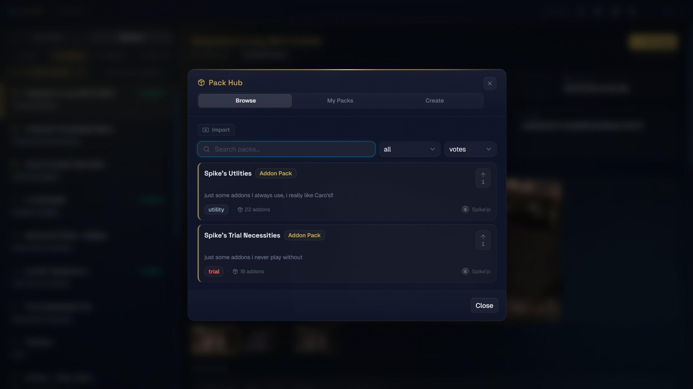
</p>
<p align="center">
  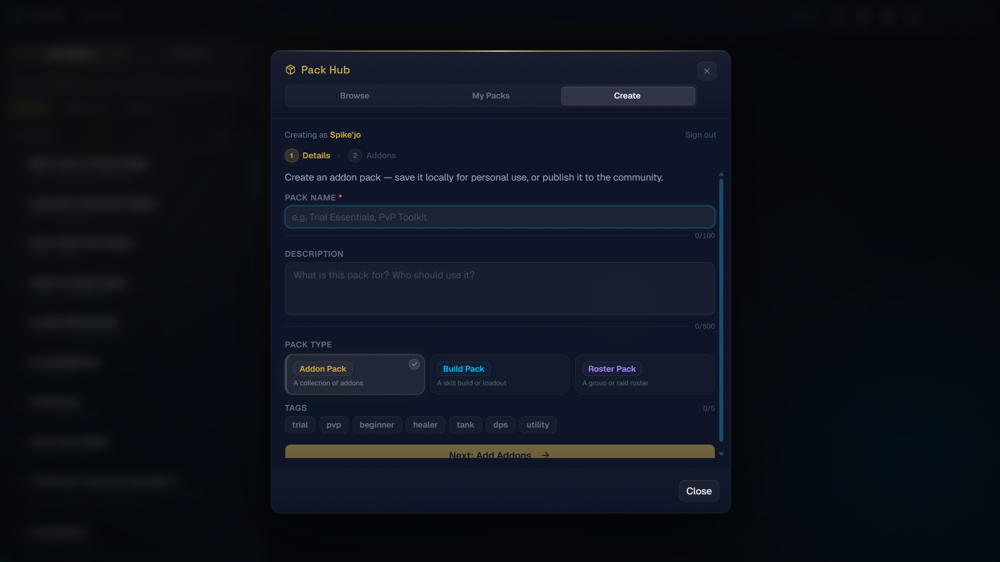
  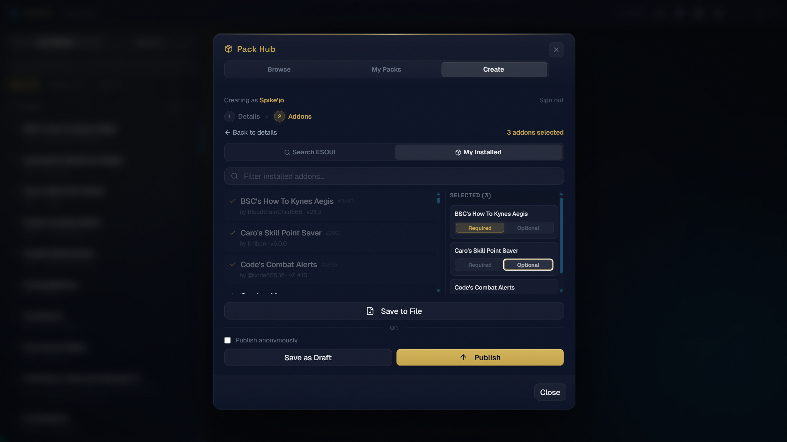
</p>
<p align="center">
  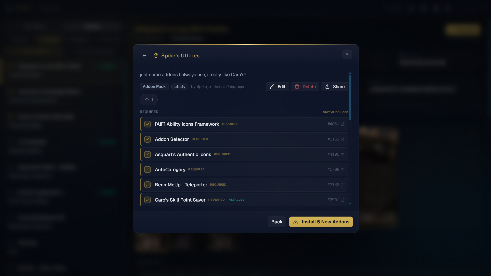
</p>

### Backups

Full and character-specific backups with safe restore and protection status.

<p align="center">
  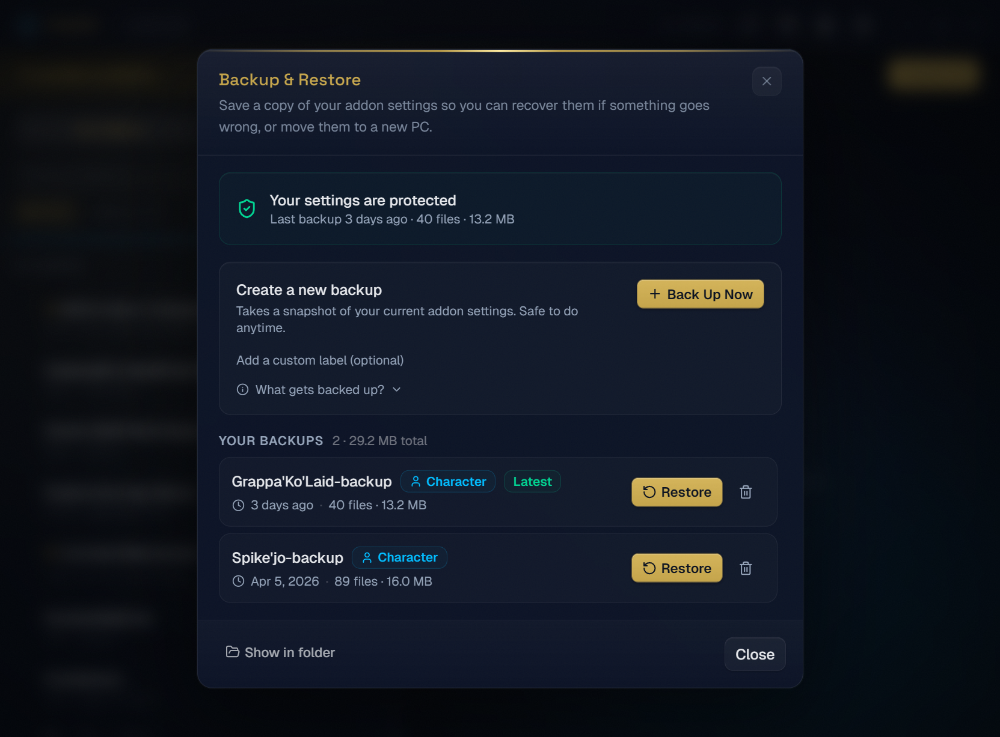
</p>
<p align="center">
  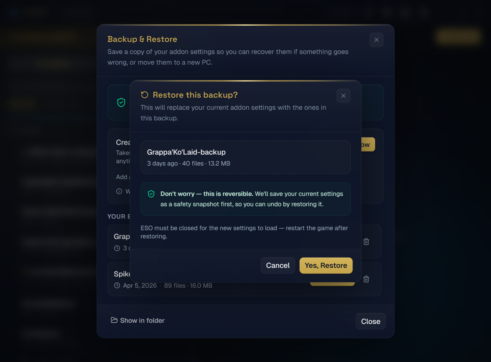
  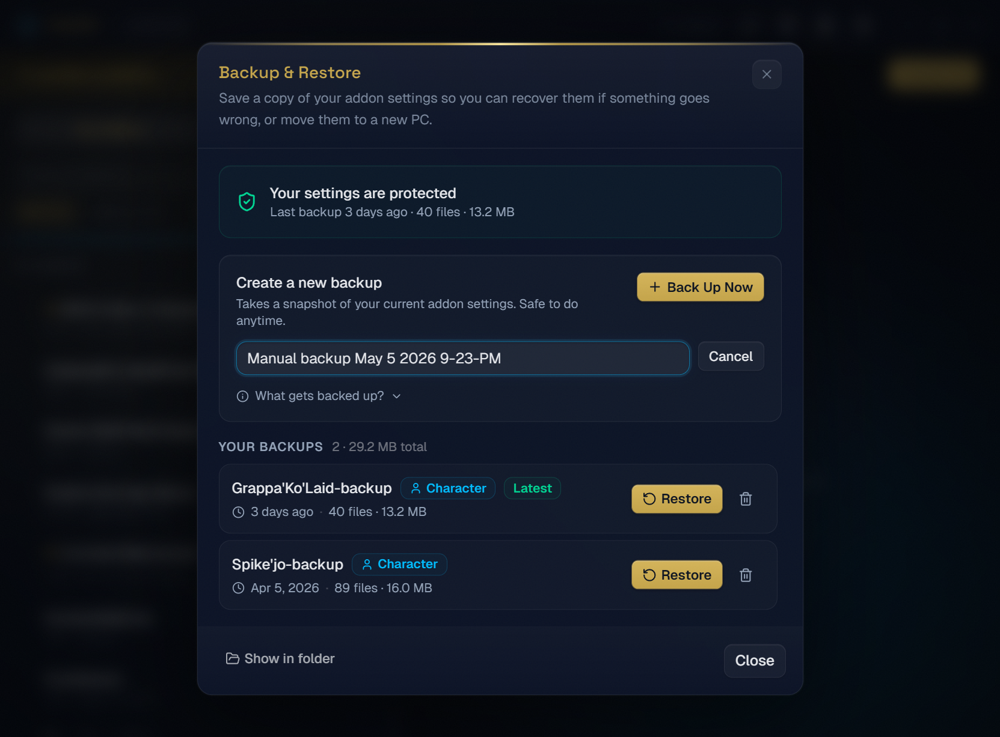
</p>

### SavedVariables Manager

Browse, edit, copy, and clean up addon settings — all from within the app.

<p align="center">
  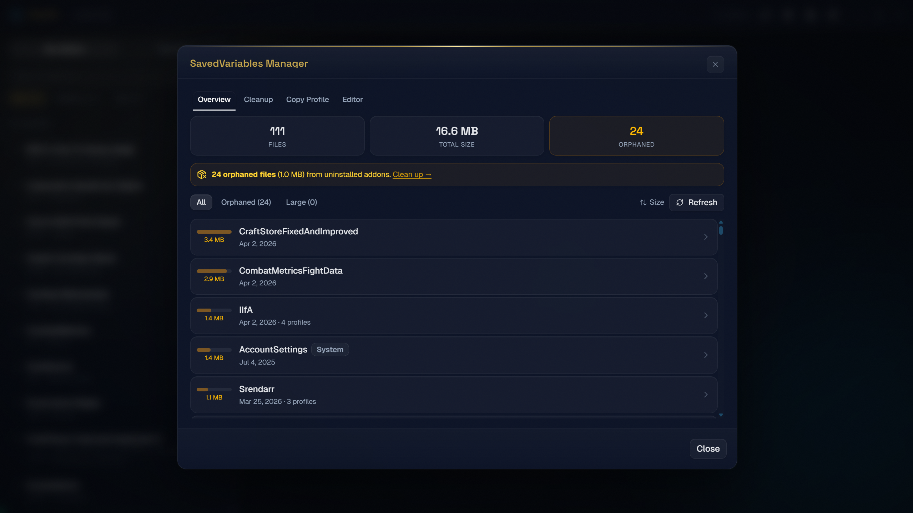
  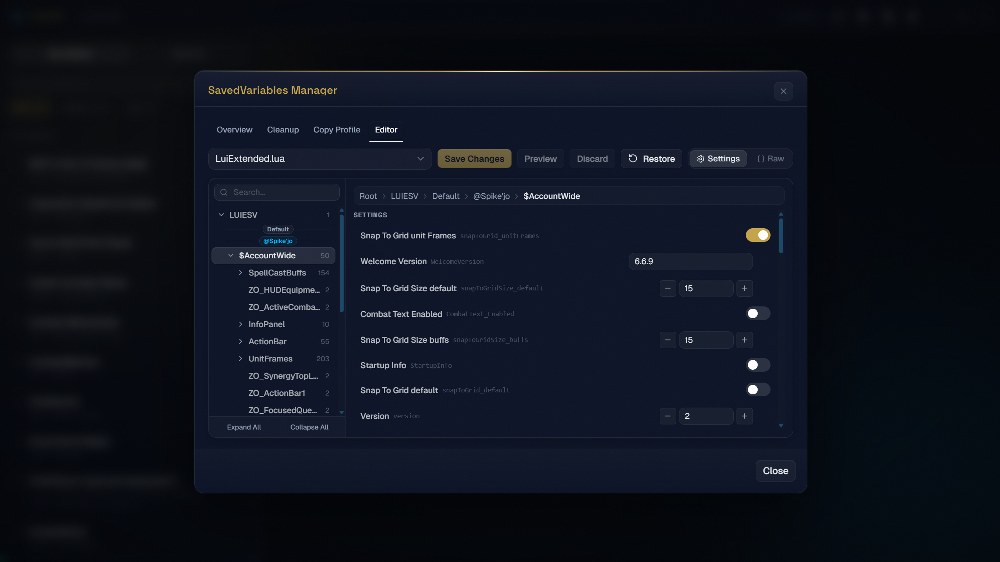
</p>
<p align="center">
  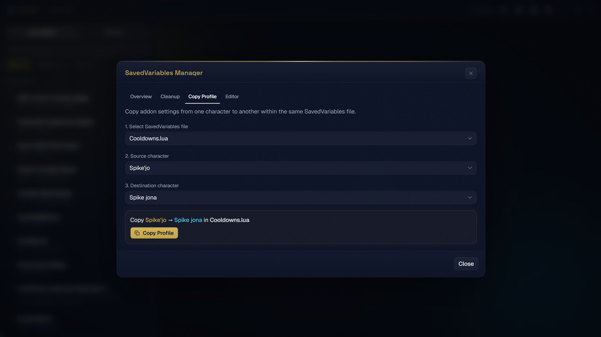
  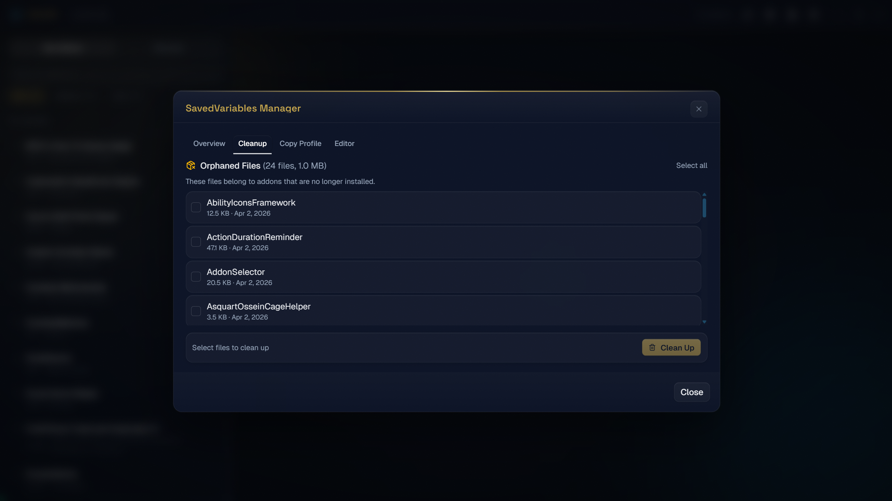
</p>

### Settings

Configure your addons folder, access tools like backups and API compatibility checks, and export/import your addon list.

<p align="center">
  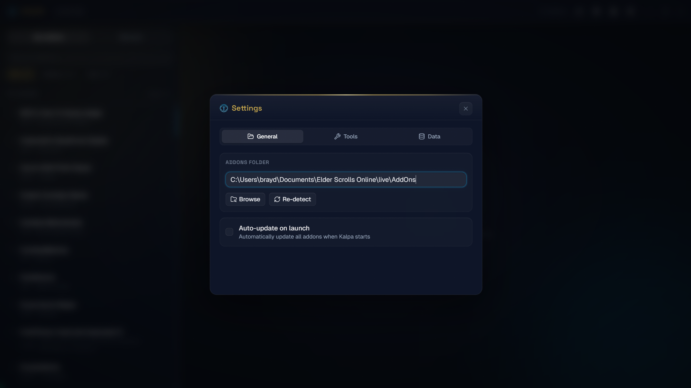
  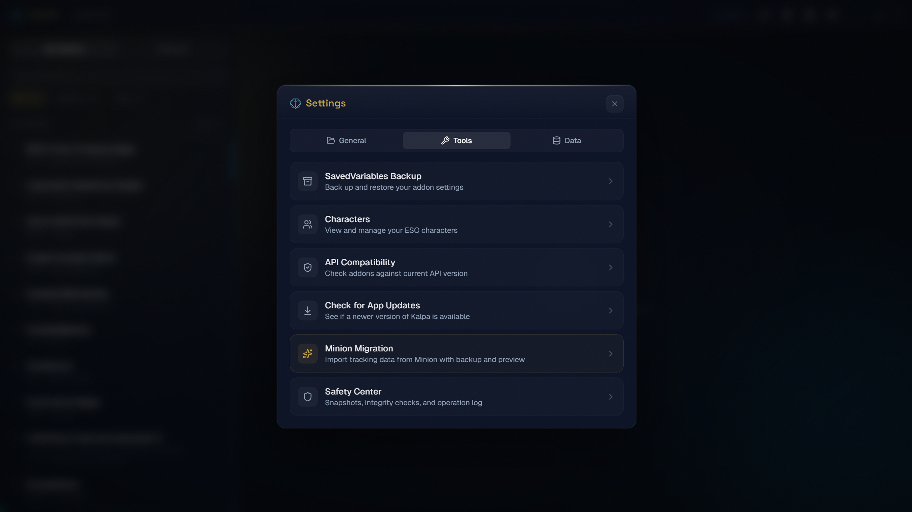
</p>
<p align="center">
  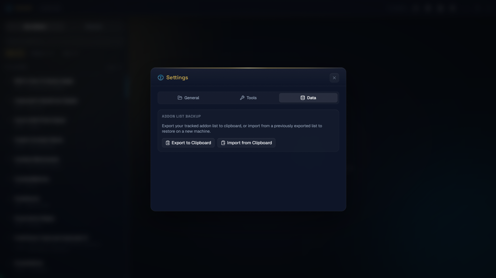
  
</p>

---

## Install

> **Platform support**
>
> | Platform | Status | Download | Notes |
> |---|---|---|---|
> | **Windows** 10 (1803+) / 11 | Stable | `.exe` (NSIS) | WebView2 pre-installed on Win 11, bootstrapped automatically on Win 10 |
> | **macOS** 10.15+ | Beta | `.dmg` (universal) | Intel & Apple Silicon; see [macOS first launch](#macos-first-launch) below |
> | **Linux** x86_64 | Beta | `.AppImage` / `.deb` / `.rpm` | AppImage recommended (it self-updates); detects ESO under Steam Proton |
>
> **Verifying your download:** every release ships the installer alongside a `.sig` (auto-updater signature) and `latest.json`. See [Verify your download](docs/verify-download.md) to check the integrity of the file you downloaded.

### Pre-built (recommended)

Download the latest installer from the [Releases](https://github.com/ESO-Toolkit/kalpa/releases/latest) page. Kalpa auto-updates after install — you'll see a banner when a new version is available. (`.deb`/`.rpm` installs are the exception: they don't self-update, so grab new versions from the Releases page or your package manager.)

#### macOS first launch

macOS builds are not yet notarized with Apple, so Gatekeeper needs a nudge the first time: **right-click Kalpa.app → Open → Open**. If macOS reports the app as "damaged", clear the quarantine flag instead:

```bash
xattr -dr com.apple.quarantine /Applications/Kalpa.app
```

ESO's native Mac client stores addons in `~/Documents/Elder Scrolls Online/live/AddOns`, which Kalpa detects automatically (CrossOver bottles are scanned too).

#### Linux notes

ESO runs on Linux through Steam Proton; Kalpa automatically finds your AddOns folder inside the Proton prefix (`steamapps/compatdata/306130/pfx/...`), including Flatpak/Snap Steam installs and secondary Steam libraries. Staying logged in to ESO Logs requires a Secret Service keyring (GNOME Keyring or KWallet — present on stock GNOME/KDE); without one, Kalpa still works but asks you to log in each launch.

### Build from source

**Prerequisites (all platforms):**
- [Rust](https://rustup.rs/) (stable)
- [Node.js](https://nodejs.org/) 22+

**Windows:**
- **MSVC** toolchain, [Visual Studio Build Tools](https://visualstudio.microsoft.com/visual-cpp-build-tools/) with the **"Desktop development with C++"** workload
- [WebView2](https://developer.microsoft.com/en-us/microsoft-edge/webview2/) runtime (pre-installed on Windows 11)

**macOS:**
- Xcode Command Line Tools: `xcode-select --install`

**Linux (Debian/Ubuntu — adjust for your distro):**
```bash
sudo apt install libwebkit2gtk-4.1-dev libgtk-3-dev libayatana-appindicator3-dev \
  librsvg2-dev patchelf libssl-dev libxdo-dev build-essential curl wget file
```

```bash
git clone https://github.com/ESO-Toolkit/kalpa.git
cd kalpa
npm install
npm run check:env       # verify prerequisites
npm run tauri dev       # development mode
npm run tauri build     # production build
```

The production build outputs installers to `src-tauri/target/release/bundle/` — NSIS `.exe` on Windows, `.app`/`.dmg` on macOS, `.AppImage`/`.deb`/`.rpm` on Linux.

### Troubleshooting

| Problem | Solution |
|---|---|
| **"MSVC toolchain not found"** | Run `rustup default stable-x86_64-pc-windows-msvc` to switch toolchains |
| **Build fails with linker errors** | Install Visual Studio Build Tools with the "Desktop development with C++" workload |
| **WebView2 not found at runtime** | Download the [Evergreen Bootstrapper](https://developer.microsoft.com/en-us/microsoft-edge/webview2/) and run it |
| **App blocked by antivirus** | Add an exception for `kalpa.exe` or the install directory in your antivirus software |
| **npm run tauri dev fails** | Run `npm run check:env` to identify which prerequisite is missing |
| **macOS: "Kalpa is damaged and can't be opened"** | The build isn't notarized yet — run `xattr -dr com.apple.quarantine /Applications/Kalpa.app` |
| **Linux: login doesn't persist between launches** | Install/enable a Secret Service keyring (GNOME Keyring or KWallet) |
| **Linux: ESO install not detected** | Kalpa scans Steam Proton prefixes (native, Flatpak, Snap Steam). Launch ESO once so the prefix exists, or set the AddOns path manually in Settings |
| **White screen on launch** | Ensure WebView2 is installed and up to date; try reinstalling it |

---

## How It Works

| Layer | What it does |
|---|---|
| **Manifest parser** | Reads `.txt` and `.addon` files from each addon folder — extracts title, version, author, dependencies, API version |
| **Manifest cache** | SQLite-backed cache for fast rescans without re-parsing every file |
| **Dependency resolver** | Scans the full AddOns tree (up to 3 levels deep) to find installed libraries, including those embedded inside other addons |
| **ESOUI client** | Fetches addon metadata via ESOUI's public JSON API and public pages — no private APIs |
| **Metadata tracker** | Persists ESOUI IDs, versions, tags, and install dates in `kalpa.json` inside your AddOns folder |
| **File hash tracker** | Tracks file hashes to detect local edits and power update conflict resolution |
| **Pack Hub worker** | Cloudflare Worker + KV that powers community pack sharing, voting, and share codes |
| **SavedVariables parser** | Reads and writes ESO's Lua-based SavedVariables files with change tracking |

---

## Tech Stack

- **Desktop app**: [Tauri v2](https://v2.tauri.app/) (Rust backend + WebView2)
- **Frontend**: React 19 + TypeScript + Vite
- **Styling**: Tailwind CSS v4 + shadcn/ui
- **Backend**: Cloudflare Workers + KV (Pack Hub)
- **HTTP**: reqwest
- **HTML parsing**: scraper
- **ZIP handling**: zip crate
- **Local database**: rusqlite (bundled SQLite)
- **SavedVariables**: Custom Lua parser

---

## Project Structure

```
src/                        # React frontend
  components/               # Feature components (addon list, packs, settings, etc.)
  components/ui/            # shadcn-ui primitives
  lib/                      # Utilities, Tauri bindings, store
  types.ts                  # Shared TypeScript interfaces

src-tauri/src/              # Rust backend
  commands.rs               # All Tauri command handlers
  esoui.rs                  # ESOUI API client and HTML scraping
  manifest.rs               # ESO addon manifest parser
  manifest_cache.rs         # SQLite-backed manifest cache
  installer.rs              # ZIP extraction and addon installation
  metadata.rs               # Metadata tracking and persistence
  file_hashes.rs            # File hashing for update conflict detection
  edit_backups.rs           # Backup system for addon file edits
  safe_migration.rs         # Minion migration with dry-run and snapshots
  game_instances.rs         # Multi-instance detection (native/Steam)
  saved_variables/          # SavedVariables Lua parser and editor
    parser.rs               # Lua table parser
    serializer.rs           # Lua table serializer
    scrub.rs                # Privacy scrubbing
    profile.rs              # SV profile management
    io.rs                   # File I/O helpers
    types.rs                # Shared types
  auth.rs                   # Authentication
  token_store.rs            # Secure credential storage (Windows Credential Manager)
  lib.rs                    # Module definitions and app setup

backend/                    # Cloudflare Workers
  eso-packs-worker/         # Pack Hub API (packs, votes, shares)
    src/index.ts            # Router and handlers
    src/kv.ts               # KV read/write helpers
    src/types.ts            # Pack types (snake_case)
    src/validate.ts         # Input validation
    src/shares.ts           # Share code generation/resolution
    src/cors.ts             # CORS config
    src/seed.ts             # Dev seed data
    src/pack-index-do.ts    # Durable Object for atomic index mutations

context/                    # Architecture and design documentation
```

---

## Contributing

Contributions are welcome! Please read our [Code of Conduct](CODE_OF_CONDUCT.md) and [Contributing Guide](CONTRIBUTING.md) before opening a PR.

## Security

To report a vulnerability, see [SECURITY.md](SECURITY.md).

## License

[BSL 1.1](LICENSE) — converts to Apache 2.0 four years after each release.
