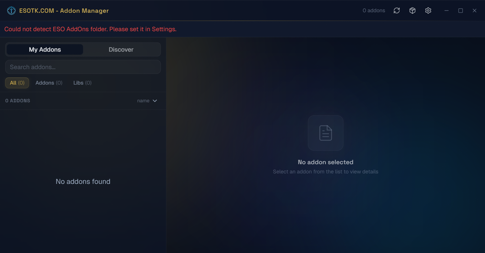
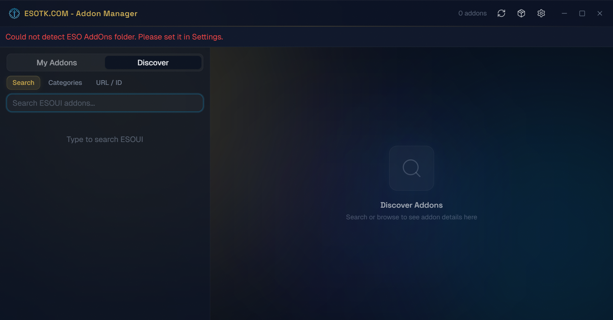
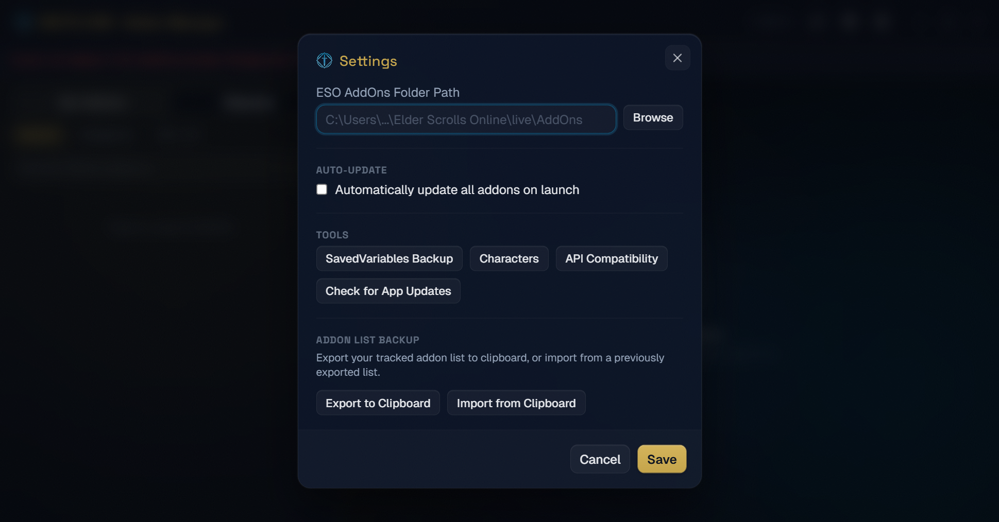

# Kalpa

[](https://github.com/ESO-Toolkit/kalpa/actions/workflows/ci.yml)
[](https://github.com/ESO-Toolkit/kalpa/releases/latest)
[](LICENSE)

A fast, open-source addon manager for **The Elder Scrolls Online**. Built with Tauri, React, and Rust — designed as a modern alternative to Minion with community features, better dependency handling, and a native desktop experience.

<p align="center">
  
</p>

---

## Why Kalpa?

Minion has served the ESO community well, but it hasn't kept pace with modern expectations. Kalpa is built from scratch to be **fast, lightweight, and community-driven**:

- **Native performance** — Rust backend with a ~15 MB installer vs. Minion's Java runtime
- **Automatic dependency resolution** — installs missing libraries without manual hunting
- **Pack Hub** — share curated addon collections with the community (no other manager has this)
- **Open source** — community contributions welcome
- **Active development** — regular updates and new features

---

## Features

### Addon Management
- **Smart scanning** — auto-detects your ESO AddOns folder and parses every addon manifest, including embedded libraries up to 3 levels deep
- **One-click install** — paste an ESOUI URL or addon ID to install instantly, with automatic dependency resolution
- **Bulk updates** — check for updates on startup and update all outdated addons at once
- **Safe removal** — remove addons with dependency warnings so you don't break other addons
- **ESOUI integration** — uses ESOUI's JSON API for reliable metadata, versions, and download links

### Discovery
- **Search ESOUI** — find new addons by keyword directly in the app
- **Browse by category** — explore addons organized by category with sorting and pagination
- **Addon details** — view descriptions, screenshots, download stats, compatibility info, and more before installing

### Pack Hub (Community Addon Collections)
- **Browse packs** — discover curated addon collections shared by the community
- **Create and publish** — build your own packs with required/optional addons and descriptions
- **Pack types** — addon packs, build packs, and roster packs for different use cases
- **Upvote system** — vote on packs to surface the best collections
- **Share codes** — generate temporary 6-character codes to share packs with friends
- **File export** — save packs as `.esopack` files for offline sharing
- **Deep links** — open packs directly via `kalpa://pack/` URLs
- **One-click install** — install all addons from a pack with a single click

### Tagging and Organization
- **Custom tags** — create and assign your own tags to organize addons
- **Preset tags** — quick-access tags for favorite, essential, utility, and more
- **Dynamic filters** — filter your addon list by any tag with live counts
- **Smart filters** — built-in filters for All, Addons, Libraries, Favorites, Outdated, and Issues

### Profiles
- **Save configurations** — snapshot your current addon setup as a named profile
- **Quick switching** — swap between profiles (e.g., "PvP", "Raiding", "Casual") instantly
- **Enable/disable** — profiles toggle addons on and off without uninstalling them

### Backups and Characters
- **Full backups** — back up all SavedVariables with custom naming
- **Character-specific backups** — back up settings for individual characters
- **Restore** — restore any backup to get your settings back
- **Character management** — view all characters grouped by server (NA/EU)

### Additional Features
- **API compatibility checking** — identify addons that are outdated for the current game API version
- **Addon list export/import** — share your installed addon list as JSON and import on another machine
- **Minion migration** — one-click import of your existing Minion addon tracking data
- **Auto-update** — the app checks for and installs its own updates
- **Offline detection** — graceful handling when you're not connected
- **Keyboard navigation** — navigate the addon list with arrow keys

---

## Screenshots

<p align="center">
  
</p>
<p align="center">
  
</p>

---

## Install

### Pre-built (recommended)

Download the latest Windows installer from the [Releases](https://github.com/ESO-Toolkit/kalpa/releases/latest) page. Available as both `.exe` (NSIS) and `.msi` installers.

### Build from source

**Prerequisites:**
- [Rust](https://rustup.rs/) (stable, MSVC toolchain on Windows)
- [Node.js](https://nodejs.org/) 18+
- Visual Studio Build Tools with "Desktop development with C++"

```bash
git clone https://github.com/ESO-Toolkit/kalpa.git
cd kalpa
npm install
npm run tauri dev       # development mode
npm run tauri build     # production build
```

The production build outputs installers to `src-tauri/target/release/bundle/`.

---

## How It Works

| Layer | What it does |
|---|---|
| **Manifest parser** | Reads `.txt` and `.addon` files from each addon folder — extracts title, version, author, dependencies, API version |
| **Dependency resolver** | Scans the full AddOns tree (up to 3 levels deep) to find installed libraries, including those embedded inside other addons |
| **ESOUI client** | Fetches addon metadata and downloads via ESOUI's public JSON API — no private APIs or screen scraping |
| **Metadata tracker** | Persists ESOUI IDs, versions, tags, and install dates in `kalpa.json` inside your AddOns folder |
| **Pack Hub worker** | Cloudflare Worker + KV that powers community pack sharing, voting, and share codes |

---

## Tech Stack

- **Desktop app**: [Tauri v2](https://v2.tauri.app/) (Rust backend + WebView2)
- **Frontend**: React 19 + TypeScript + Vite
- **Styling**: Tailwind CSS v4 + shadcn/ui
- **Backend**: Cloudflare Workers + KV (Pack Hub)
- **HTTP**: reqwest
- **HTML parsing**: scraper
- **ZIP handling**: zip crate

---

## Project Structure

```
src/                        # React frontend
  components/               # Feature components (addon list, packs, settings, etc.)
  components/ui/            # shadcn-ui primitives
  lib/                      # Utilities, Tauri bindings, store
  types.ts                  # Shared TypeScript interfaces

src-tauri/src/              # Rust backend
  commands.rs               # All Tauri command handlers
  esoui.rs                  # ESOUI API client
  manifest.rs               # ESO addon manifest parser
  installer.rs              # ZIP extraction and addon installation
  metadata.rs               # Metadata tracking and persistence
  lib.rs                    # Module definitions and app setup

backend/                    # Cloudflare Workers
  eso-packs-worker/         # Pack Hub API (packs, votes, shares)

context/                    # Architecture and design documentation
```

---

## Contributing

Contributions are welcome! See [CONTRIBUTING.md](CONTRIBUTING.md) for guidelines.

Please open an issue first to discuss what you'd like to change.

## Security

To report a vulnerability, see [SECURITY.md](SECURITY.md).

## License

[BSL 1.1](LICENSE) — converts to Apache 2.0 four years after each release.
