# Kalpa

[](https://github.com/ESO-Toolkit/kalpa/actions/workflows/ci.yml)
[](https://github.com/ESO-Toolkit/kalpa/releases/latest)
[](LICENSE)

An addon manager for **The Elder Scrolls Online**, built with Tauri and Rust. A replacement for Minion with real dependency resolution, shared addon packs, and a built-in ESO Logs uploader.

<p align="center">
  <a href="#install">Install</a> ·
  <a href="#features">Features</a> ·
  <a href="#accessibility">Accessibility</a> ·
  <a href="#screenshots">Screenshots</a> ·
  <a href="#security--privacy">Security</a> ·
  <a href="CONTRIBUTING.md">Contributing</a>
</p>

<p align="center">
  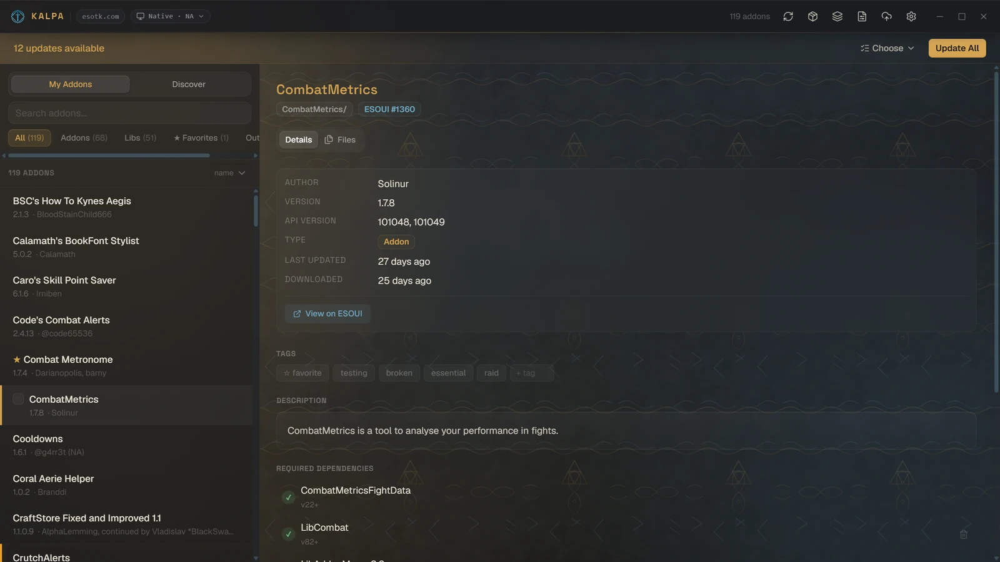
</p>

> [!NOTE]
> **Beta.** Windows is stable for daily use. The macOS and Linux builds are newer and less tested. Installers are on the [Releases](https://github.com/ESO-Toolkit/kalpa/releases/latest) page and the app updates itself from there. Bugs and feedback go to [Issues](https://github.com/ESO-Toolkit/kalpa/issues), including accessibility reports, which have their own template; recent changes are in the [changelog](CHANGELOG.md).

---

## Why Kalpa?

Minion is a Java app that hasn't kept pace. Kalpa is a rewrite of the same idea on a native stack:

- **No bundled runtime.** A Rust backend instead of Minion's Java: 17 MB to install on Windows, 10 MB from the Linux `.deb`/`.rpm`. (The AppImage is 84 MB because it carries its own GTK and WebKit.)
- **Suspends itself while you play.** Minimized, the webview releases its memory and drops to under 20 MB with no measurable CPU, from around 250 MB with the window open. Task Manager figures on a 119-addon profile.
- **Dependency resolution that actually resolves**, including transitive dependencies, embedded libraries, and version checks.
- **Pack Hub**, for publishing and installing shared addon collections. Minion has no equivalent.

---

## Features

### Addons

Kalpa finds your AddOns folder on first run and parses every manifest it contains, following embedded libraries up to three levels deep. Paste an ESOUI URL or addon ID to install, and anything the addon depends on is pulled in with it.

- **Choose which libraries get installed** — by default Kalpa asks before pulling in an addon's dependencies, listing required ones ticked and optional ones unticked so you can take all, some, or none. Turn the prompt off (always install, or never) in Settings. Skipping a required library warns you but never blocks.
- **Bulk updates** — update everything at once or pick a subset. Large updates report per-addon progress and can be stopped partway.
- **Update conflicts** — if an update would overwrite a file you edited locally, Kalpa shows a per-file diff and lets you choose which side wins for each one.
- **Removal warnings** — removing an addon that others depend on tells you before it happens, not after.
- **Safety Center** — a single view of outstanding dependency warnings and conflicts.
- **Updates while ESO is running** — warns instead of blocking. Changes take effect on `/reloadui` or relog.
- **Controlled Folder Access detection** — Windows CFA silently fails addon writes. Kalpa notices and walks you through allowing it.

Addon metadata, versions, and download links come from ESOUI's public JSON API and public pages. No private APIs.

### Discovery

Search ESOUI by keyword, browse by category, or work through the Popular tab with filters and sorting. Selecting a result shows its description, screenshots, download counts, and API compatibility before you commit to installing it.

### ESO Logs uploader

Sign in with your ESO Logs account and send a session to esologs.com without switching apps. If you'd rather use the official uploader, Kalpa can hand off to it instead.

- **Live logging** — stream a raid as it happens and watch the report fill in.
- **Session splitting** — break a multi-session `Encounter.log` into separate files, or upload only the fights you select.
- **Anchored scanning** — multi-gigabyte logs seek to the newest session instead of rescanning from byte zero.
- **Upload progress** — phase stepper, determinate progress bar, and a time-remaining estimate.
- **Visibility and history** — pick the report's visibility before upload. Every report's link is kept in the upload history.

### Pack Hub

A pack is a named set of addons that someone can install in one click. Packs come in three flavors: addon packs, build packs, and roster packs.

- **Browse and vote** on packs published by other people.
- **Publish your own**, with addons marked required or optional.
- **Share codes** — six-character codes for handing a pack to a friend temporarily.
- **`.esopack` files** for offline sharing. Version 2 can carry your account-wide addon settings, scrubbed of personal data first.
- **Deep links** — `kalpa://pack/` URLs open a pack directly, including roster installs from the ESO Toolkit site.

### Themes

Fifty-four built-in themes live under Settings → Appearance: eight Elder Scrolls art skins (Nordic Runestone, Daedric Obsidian, Dwemer Brass, Hermaeus Mora and others), ESO faction palettes, editor classics like Dracula, Nord, and Catppuccin, and five built for legibility.

The theme builder takes twelve seed colors and previews the result live, with a WCAG AA contrast check to catch unreadable combinations. Themes copy and paste as plain text. Whichever theme is active is applied before the window first paints, so there's no flash of the wrong palette on launch.

### Accessibility

A player with low vision reported that Kalpa's text was both too faint and too small ([#199](https://github.com/ESO-Toolkit/kalpa/issues/199)). Three things came out of it.

- **Text that keeps its theme's contrast.** Every theme defined readable muted text and none of them delivered it: components faded that text with an opacity multiplier _after_ the theme had chosen the color. The worst case rendered at 1.9:1 in a theme that measured 5.1:1, and trying a different theme could not help, because the fade sat on top of whichever one was active. Readable text now paints at full strength, and a test fails if any of it starts fading again.
- **A text size control** in Settings → Appearance — 100%, 110%, 125% or 150%, also on `Ctrl`/`⌘` with `+`, `-` and `0`. It scales the whole interface rather than body copy alone: Kalpa's smallest labels are set in fixed pixels, so a font-size slider would have skipped exactly the text that was hard to read. At 150% the minimum window grows to 1200 × 750, which still fits a 1366 × 768 laptop.
- **Light and high-contrast themes.** A new Accessibility category, placed third in the gallery so it sits ahead of the decorative sets, holds two high-contrast dark themes that clear 12:1 on every pair the contrast checker measures, plus three light ones: Paper White, Soft Grey and Warm Parchment. Light themes render correctly because borders, dividers, panel fills and status colors now follow the theme's own lightness instead of assuming a dark background.

### Profiles

A profile is a snapshot of which addons are enabled, scoped to one game install.

- **Activation preview** — before switching, see exactly which addons will be enabled or disabled and which required libraries stay on. An old snapshot can't silently disable a library something else needs.
- **Update, rename, inspect** — overwrite a profile with your current setup, rename it in place, or expand it to see its contents. A "modified" marker appears once your setup drifts from the snapshot.
- **Mirrored to app data**, so profiles survive the AddOns folder being deleted or reset.

### Backups and characters

- **Full backups** of every SavedVariables file, with an optional label.
- **Per-character backups** that touch only that character's data, keeping same-named characters on NA and EU distinct.
- **Safety snapshot** taken automatically before any restore, so a restore is undoable.
- **Backup status** showing the date of your last backup and what it covers.
- **Character discovery in Account-Wide mode** — ESO's default settings mode omits per-character headers from `AddOnSettings.txt`, which hides most of a roster. Kalpa unions the SavedVariables files to recover the names.

### SavedVariables

- **Real labels, not raw keys** — Kalpa reads each addon's LibAddonMenu source to render labeled toggles and dropdowns in place of raw Lua values. The scan is textual; no addon code is executed.
- **Search across the tree**, with jump-to-group for large settings files.
- **Orphan detection** for settings files left behind by uninstalled addons.
- **Profile copy and delete** between characters and accounts.
- Every edit is backed up first.

### Multiple game installs

Kalpa detects native and Steam installations across NA, EU, and PTS. A header badge shows which one you're managing and opens a switcher when it finds more than one.

- **Copy to another instance** — install your enabled addons into a second install, metadata and tags included, without disturbing what's already there. Useful for seeding PTS from live.
- **Minion migration** — import Minion's tracking data with a dry-run preview, integrity checks, and a snapshot beforehand. Your original Minion data is never deleted.

### Also

- **Native performance UI (beta, Windows)** — an opt-in mode that relaunches Kalpa as one native process instead of a webview and its six helpers, which cuts memory with the window open to about 85 MB from around 135 MB. It suspends when minimized too, releasing its working set and dropping to about 11 MB — measured on the sidecar binary itself, so expect a little more with a large addon list loaded. It covers addon management, the uploader, and Pack Hub. Switch back from Settings at any time; if it fails to start, Kalpa reverts to the standard UI on its own.
- **Addon file browser** — read and edit an addon's Lua, XML, and text files in place, with a backup taken before each edit.
- **Tags and filters** — preset and custom tags, live-counted filters, and built-in views for Addons, Libraries, Favorites, Outdated, and Issues. Sort by name, author, recently updated, or recently downloaded.
- **API compatibility check** against the current game version.
- **Addon list export and import** as JSON, for moving a setup between machines.
- **Self-updating** through signed GitHub Releases.
- Minimizes to the system tray, handles being offline, and takes arrow-key navigation in the addon list.

---

## Security & privacy

- **Download allowlist** — addon downloads are restricted to ESOUI's official hosts. Arbitrary URLs are rejected.
- **Path validation** — path-taking IPC commands canonicalize caller-supplied paths and confine them to the approved AddOns folder before any I/O. The uploader applies its own equivalent check against the ESO Logs folder.
- **ZIP extraction** rejects absolute paths, drive prefixes, and `..` components, skips symlink entries, and caps total extraction at 500 MB. That is what stops path traversal and zip bombs.
- **Content-Security-Policy** — strict, with `frame-ancestors 'none'` to block clickjacking and embedding.
- **Pack Hub worker** rate-limits requests and serializes pack-index mutations through a Durable Object.
- **Dependency audits** run in CI on every pull request and every push to main: `npm audit` over production dependencies and `cargo audit` over the main Rust lockfile. The Slint sidecar also rejects any resolved `quick-xml` version below the patched 0.41.0 release. Advisories without an upstream fix are assessed individually and recorded beside their CI gate.
- **Signed updates** delivered through GitHub Releases. See [Verify your download](docs/verify-download.md).

When you export account-wide settings in a `.esopack` v2, Kalpa strips personal data before writing the file: account handles, character names and IDs, chat logs, mail, friends and roster lists, trade history. Placeholders are mapped back to your own identity on import. [What's scrubbed in `.esopack` v2](docs/settings-export.md) has the full list, including what is deliberately kept.

Uploading a log sends it to esologs.com under your account, and you choose the report's visibility before anything leaves your machine. [PRIVACY.md](PRIVACY.md) covers what each upload path transmits.

Vulnerability reports go to [SECURITY.md](SECURITY.md).

---

## Screenshots

### Discover

The Discover tab on ESOUI's Popular list, with the selected addon's stats, screenshot gallery, and description.

<p align="center">
  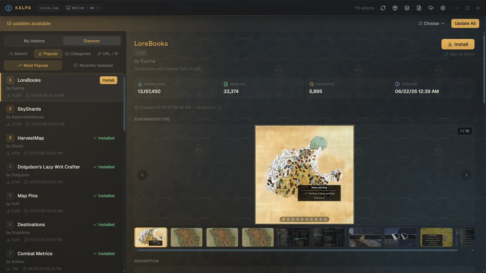
</p>

### ESO Logs uploader

The uploader with both modes available and the detected log files listed.

<p align="center">
  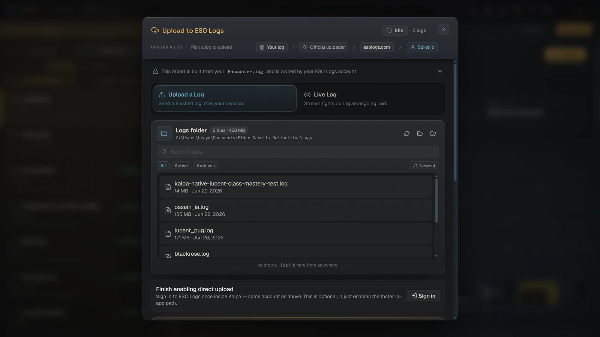
</p>

### Pack Hub

The browse tab, listing published packs with their vote counts and type filters.

<p align="center">
  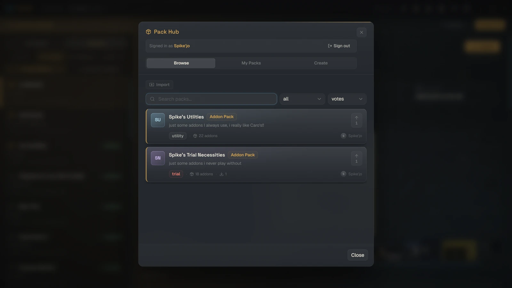
</p>

<details>
<summary>Pack details and the create flow</summary>

<p align="center">
  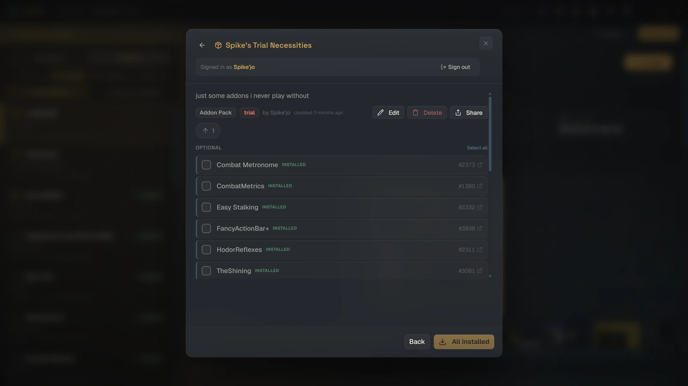
</p>
<p align="center">
  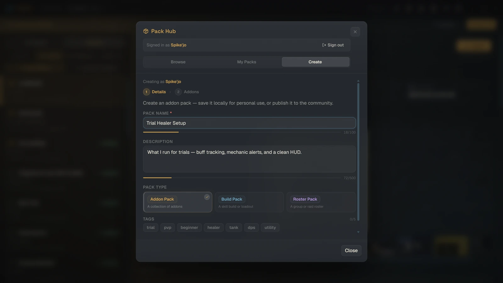
</p>
<p align="center">
  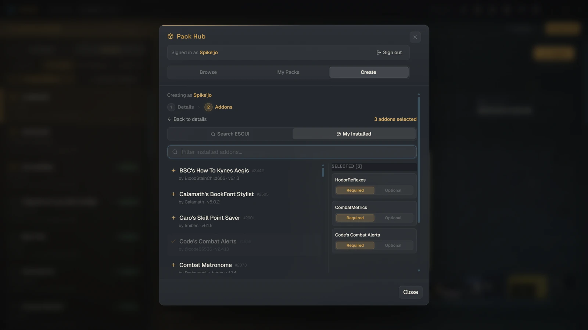
</p>

</details>

### Themes

The theme gallery in Settings → Appearance, with Nordic Runestone active.

<p align="center">
  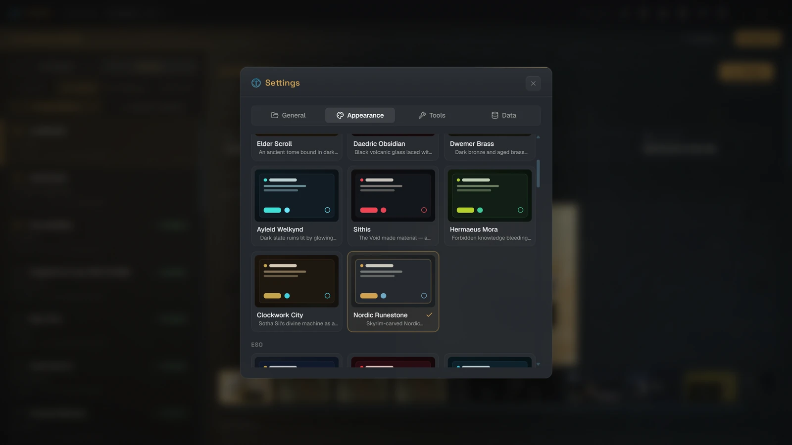
</p>

### Text size and light themes

Settings → Appearance in the Paper White theme, with the interface scale control and its keyboard shortcuts.

<p align="center">
  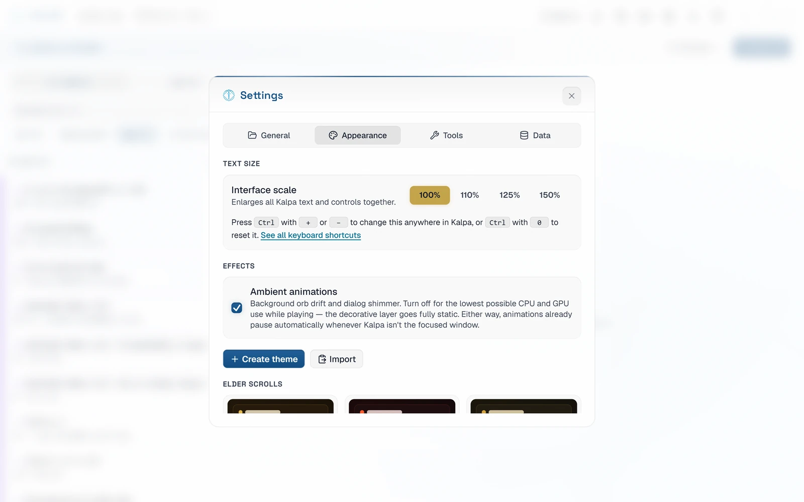
</p>

### SavedVariables

An addon's settings tree beside its editable values, labeled from the addon's own LibAddonMenu definitions.

<p align="center">
  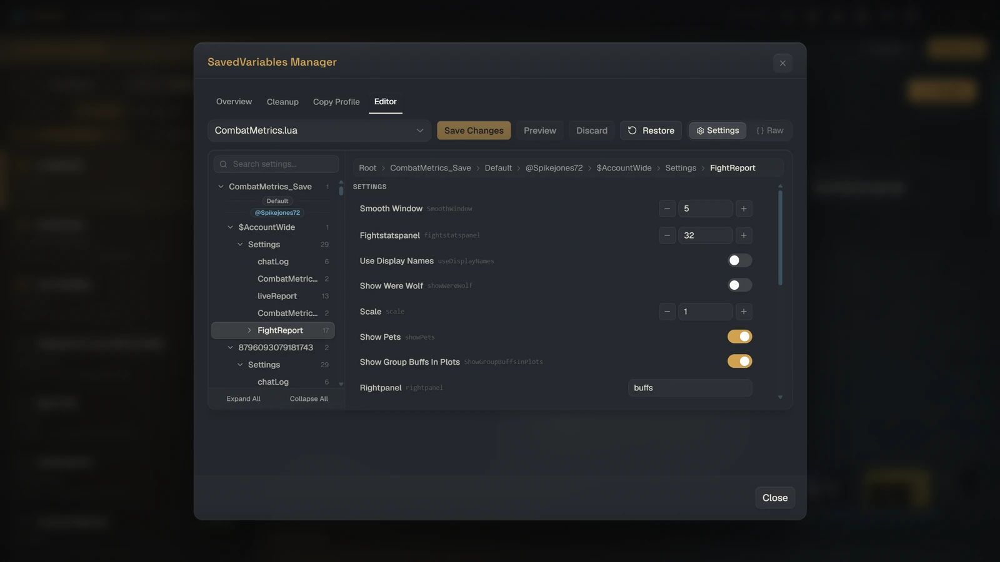
</p>

<details>
<summary>Overview and orphan detection</summary>

<p align="center">
  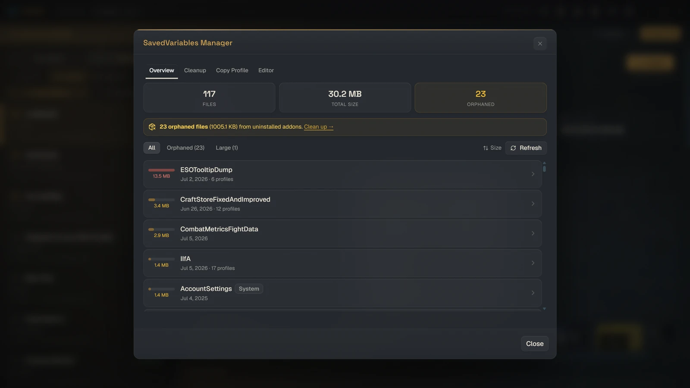
</p>

</details>

### Backups

Backup status, the existing backups, and their restore actions.

<p align="center">
  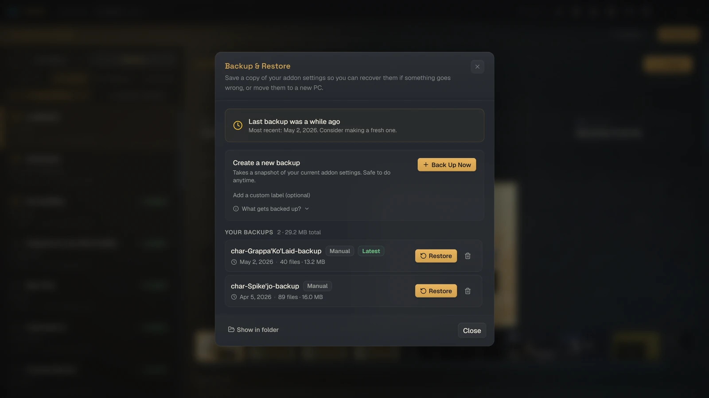
</p>

### Settings

The General tab: AddOns folder, the detected NA/EU/PTS installs, and the native performance UI toggle.

<p align="center">
  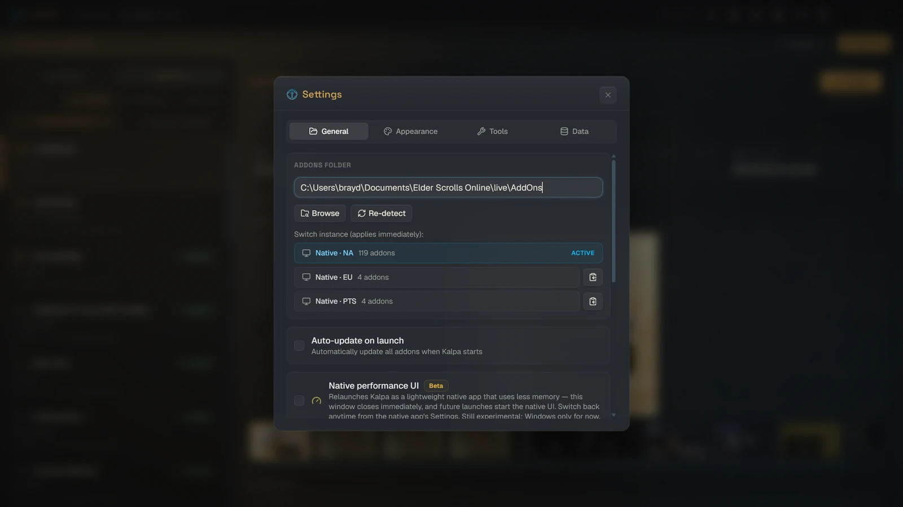
</p>

<details>
<summary>Profiles and the tools menu</summary>

<p align="center">
  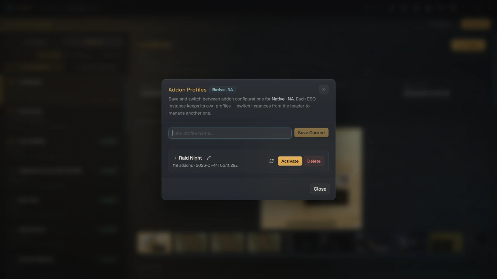
</p>
<p align="center">
  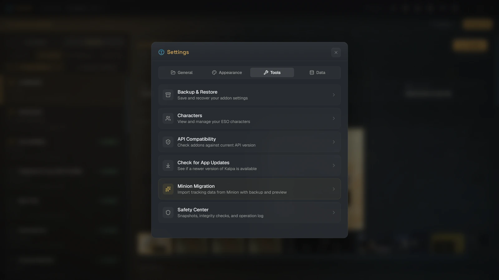
</p>

</details>

---

## Install

### Platform support

| Platform                    | Status | Download                      | Notes                                                            |
| --------------------------- | ------ | ----------------------------- | ---------------------------------------------------------------- |
| **Windows** 10 (1803+) / 11 | Stable | `.exe` (NSIS)                 | WebView2 ships with Win 11 and is bootstrapped on Win 10         |
| **macOS** 10.15+            | Beta   | `.dmg` (universal)            | Intel and Apple Silicon. See [first launch](#macos-first-launch) |
| **Linux** x86_64            | Beta   | `.AppImage` / `.deb` / `.rpm` | AppImage self-updates. Detects ESO under Steam Proton            |

> [!IMPORTANT]
> Each release ships a `.sig` updater signature for every auto-updatable artifact, plus one shared `latest.json`. The `.dmg` is the exception: macOS updates ship as the `.app.tar.gz`, so that is what gets signed. [Verify your download](docs/verify-download.md) explains how to check what you downloaded.

### Pre-built (recommended)

Grab the installer from the [Releases](https://github.com/ESO-Toolkit/kalpa/releases/latest) page. Kalpa updates itself after that and shows a banner when a new version lands. The `.deb` and `.rpm` packages are the exception: they don't self-update, so take new versions from Releases or your package manager.

#### macOS first launch

macOS builds aren't notarized yet, so Gatekeeper needs a nudge the first time: right-click Kalpa.app, choose Open, then Open again. If macOS calls the app damaged, clear the quarantine flag instead:

```bash
xattr -dr com.apple.quarantine /Applications/Kalpa.app
```

ESO's Mac client keeps addons in `~/Documents/Elder Scrolls Online/live/AddOns`, which Kalpa finds on its own. CrossOver bottles are scanned too.

#### Linux notes

ESO runs on Linux through Steam Proton, and Kalpa locates the AddOns folder inside the Proton prefix (`steamapps/compatdata/306130/pfx/...`), including Flatpak and Snap Steam installs and secondary Steam libraries.

Staying signed in to ESO Logs needs a Secret Service keyring (GNOME Keyring or KWallet, both present on stock GNOME and KDE). Without one Kalpa still works, but asks you to sign in each launch.

### Build from source

Every platform needs [Rust](https://rustup.rs/) (stable) and [Node.js](https://nodejs.org/). `engines.node` in `package.json` is the supported range, `.nvmrc` records a known-good version, and `npm run check:env` tells you whether yours qualifies.

**Windows** also needs the MSVC toolchain via [Visual Studio Build Tools](https://visualstudio.microsoft.com/visual-cpp-build-tools/) with the "Desktop development with C++" workload, plus the [WebView2](https://developer.microsoft.com/en-us/microsoft-edge/webview2/) runtime (already present on Windows 11).

**macOS** needs the Xcode command line tools: `xcode-select --install`.

**Linux** (Debian/Ubuntu; adjust for your distro):

```bash
sudo apt install libwebkit2gtk-4.1-dev libgtk-3-dev libayatana-appindicator3-dev \
  librsvg2-dev patchelf libssl-dev libxdo-dev build-essential curl wget file
```

```bash
git clone https://github.com/ESO-Toolkit/kalpa.git
cd kalpa
npm install
cp .env.example .env.local   # sets VITE_PORT, which devUrl expects
npm run check:env            # verify prerequisites
npm run tauri dev            # development mode
npm run tauri build          # production build
```

`.env.local` is machine-local and gitignored, so it does not exist on a fresh clone. Without it Vite serves on a different port than `src-tauri/tauri.conf.json`'s `devUrl`, and `npm run tauri dev` waits indefinitely for a dev server that never appears.

Installers land in `src-tauri/target/release/bundle/`: NSIS `.exe` on Windows, `.app` and `.dmg` on macOS, `.AppImage`, `.deb`, and `.rpm` on Linux.

### Troubleshooting

| Problem                                                         | Solution                                                                                                                                            |
| --------------------------------------------------------------- | --------------------------------------------------------------------------------------------------------------------------------------------------- |
| **"MSVC toolchain not found"**                                  | `rustup default stable-x86_64-pc-windows-msvc`                                                                                                      |
| **Linker errors during build**                                  | Install Visual Studio Build Tools with the "Desktop development with C++" workload                                                                  |
| **WebView2 not found at runtime**                               | Run the [Evergreen Bootstrapper](https://developer.microsoft.com/en-us/microsoft-edge/webview2/)                                                    |
| **Antivirus blocks the app**                                    | Add an exception for `kalpa.exe` or its install directory                                                                                           |
| **Updates fail with "access denied", or addons vanish in-game** | Windows Controlled Folder Access is blocking writes. Kalpa offers a guided fix, or allow `kalpa.exe` under Windows Security → Ransomware protection |
| **`npm run tauri dev` fails**                                   | `npm run check:env` reports which prerequisite is missing                                                                                           |
| **`npm run tauri dev` hangs waiting for the dev server**        | `.env.local` is missing: `cp .env.example .env.local` so Vite's port matches `devUrl` in `src-tauri/tauri.conf.json`                                |
| **macOS: "Kalpa is damaged and can't be opened"**               | Not notarized yet: `xattr -dr com.apple.quarantine /Applications/Kalpa.app`                                                                         |
| **Linux: sign-in doesn't persist**                              | Install or enable a Secret Service keyring (GNOME Keyring or KWallet)                                                                               |
| **Linux: ESO install not detected**                             | Kalpa scans Steam Proton prefixes, including Flatpak and Snap. Launch ESO once so the prefix exists, or set the AddOns path manually in Settings    |
| **White screen on launch**                                      | Check WebView2 is installed and current; reinstalling it usually fixes this                                                                         |

---

## How it works

| Layer                     | What it does                                                                                                             |
| ------------------------- | ------------------------------------------------------------------------------------------------------------------------ |
| **Manifest parser**       | Reads `.txt` and `.addon` files from each addon folder, extracting title, version, author, dependencies, and API version |
| **Manifest cache**        | SQLite-backed, so rescans don't re-parse every file                                                                      |
| **Dependency resolver**   | Walks the AddOns tree three levels deep to find installed libraries, including ones embedded inside other addons         |
| **ESOUI client**          | Fetches metadata from ESOUI's public JSON API and public pages                                                           |
| **Metadata tracker**      | Persists ESOUI IDs, versions, tags, and install dates in `kalpa.json` inside your AddOns folder                          |
| **File hash tracker**     | Detects locally edited files, which is what drives update conflict resolution                                            |
| **SavedVariables parser** | Reads and writes ESO's Lua settings files with change tracking                                                           |
| **Log uploader**          | Scans, splits, encodes, and uploads `Encounter.log` sessions, including live streaming                                   |
| **Pack Hub worker**       | Cloudflare Worker plus KV backing pack sharing, voting, and share codes                                                  |

---

## Tech stack

- **Desktop app**: [Tauri v2](https://v2.tauri.app/), a Rust backend plus the system webview (WebView2, WKWebView, or WebKitGTK)
- **Frontend**: React 19, TypeScript, Vite
- **Styling**: Tailwind CSS v4, shadcn/ui
- **Native performance UI** (beta, Windows): a [Slint](https://slint.dev/) sidecar, `kalpa-slint`
- **Backend**: Cloudflare Workers and KV, for Pack Hub
- **Rust crates**: reqwest, scraper, zip, rusqlite (bundled SQLite)
- **SavedVariables**: a custom Lua parser

---

## Project structure

```
src/                        # React frontend
  __mocks__/                # Shared frontend test mocks
  __tests__/                # Frontend setup and source-hygiene tests
  components/               # Feature components (addon list, packs, settings)
  components/__tests__/     # Feature-component tests
  components/animate-ui/    # Motion primitives grouped by animate/base/buttons/effects/texts
  components/ui/            # shadcn-ui primitives
  components/uploader/      # ESO Logs uploader workspace
  components/uploader/__tests__/ # Uploader component and reducer tests
  hooks/                    # Shared React hooks
  hooks/__tests__/          # Shared hook tests
  lib/                      # Utilities, Tauri bindings, store, theme presets
  lib/__tests__/            # Frontend utility and contract tests
  types.ts                  # Shared TypeScript interfaces

e2e/                       # Windows WebView2 read-only and sandbox Playwright specs

src-tauri/src/              # Rust backend
  commands.rs               # All Tauri command handlers
  esoui.rs                  # ESOUI API client and HTML scraping
  manifest.rs               # ESO addon manifest parser
  manifest_cache.rs         # SQLite-backed manifest cache
  installer.rs              # ZIP extraction and addon installation
  metadata.rs               # Metadata tracking and persistence
  file_hashes.rs            # File hashing for update conflict detection
  edit_backups.rs           # Backups for addon file edits
  safe_migration.rs         # Minion migration with dry-run and snapshots
  game_instances.rs         # Multi-instance detection (native/Steam)
  platform.rs               # Cross-platform helpers (Steam/Proton discovery, open_url)
  settings_store.rs         # Atomic app-settings persistence
  saved_variables/          # SavedVariables parsing, scrubbing, per-character backups
  uploader/                 # ESO Logs uploader (scan, split, encode, upload, live)
  auth.rs                   # Authentication
  token_store.rs            # Credential storage (Credential Manager / Keychain / Secret Service)
  lib.rs                    # Module definitions and app setup

backend/eso-packs-worker/   # Pack Hub API (packs, votes, shares)
  src/index.ts              # Router and handlers
  src/kv.ts                 # KV read/write helpers
  src/types.ts              # Pack types (snake_case)
  src/validate.ts           # Input validation
  src/shares.ts             # Share code generation and resolution
  src/pack-index-do.ts      # Durable Object for atomic index mutations
  test/                     # Worker unit, route, Durable Object, and scheduled tests

prototypes/slint-kalpa/     # Native (Slint) performance UI sidecar
context/                    # Architecture and design documentation
docs/                       # User-facing and design docs
```

---

## Contributing

Contributions are welcome. Please read the [Code of Conduct](CODE_OF_CONDUCT.md) and [Contributing Guide](CONTRIBUTING.md) before opening a PR.

## Security

Vulnerability reports: [SECURITY.md](SECURITY.md).

## License

[BSL 1.1](LICENSE), which permits non-production and non-commercial use and converts to Apache 2.0 four years after each release. The source is public, but this is source-available licensing, not open source in the OSI sense.
